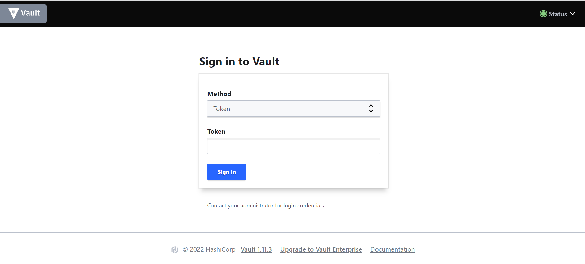
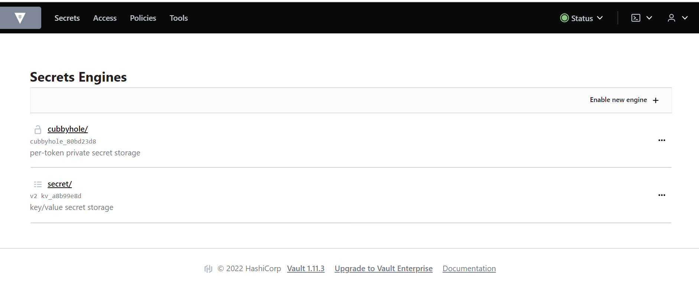

# HASHICORP VAULT

## Purpose 

This docker-compose file will spin up a hashicorp vault server container on your localhost. 

This container should be used to support local development only.

Examples:
- https://github.com/hashicorp/vault-action#example-usage
- https://www.hashicorp.com/blog/integrating-azure-ad-identity-hashicorp-vault-part-1-application-auth-oidc
- https://github.com/anubhavmishra/vault-on-azure
- https://github.com/devops-rob/terraform-azuread-app-vault
- https://www.youtube.com/watch?v=-ayAYPqbPtk
- https://www.hashicorp.com/blog/hashicorp-vault-use-cases-and-best-practices-on-azure
- https://www.vaultproject.io/docs/auth/azure


---
## Getting Started

1. Set Enviornment Variables 

    | **Environment Variable**      |  **Purpose**                                         |
    | ------------------------------| -----------------------------------------------------|
    |                               |                                                      | 
    | __VAULT_DEV_ROOT_TOKEN_ID__   | This is the token for your vault                     |
    |                               |                                                      |


2. Build the Docker Image 
    ```
    make build 
    ```
    OR
    ```
    docker-compose build --no-cache
    ```
    > Note: This is a one of exercise (unless you delete this image)


3. Start the Docker Container 
    ```
    make start
    ```
    OR
    ```
    docker-compose up -d
    ```

---

## Test Connection

### Test Outside the Docker Container

Using the Vault Web Browser

(a) Navigate to http://localhost:8200/
    

(b) Enter your __VAULT_DEV_ROOT_TOKEN_ID__ token to login 

(c) Under the secrets engine you will see some engines available
    

(d) Download the vault client cli https://www.vaultproject.io/downloads

(e) In your terminal, login to your vault 

    export VAULT_ADDR='http://localhost:8200/'

> Note: This should match the VAULT_ADDR in the docker-compose file

(f) Login to your vault and enter your token when prompted

    vault login

(d) Add a password to your vault 

    vault kv put -mount=secret foo bar=baz
OR
    
    vault kv put -mount=secret foo @data.json
    
-  secret is the name of a secret engine 
- foo is the path for the secret to be stored on 
- bar is the key for the secret
- baz is the value of your secrets
- @data.json if your secret is a json file

(e) Retreive secret 

    vault kv get --mount secret foo


---
## Using this in a Project

### Github Actions

- An example of how to use this in github actions can be found here


