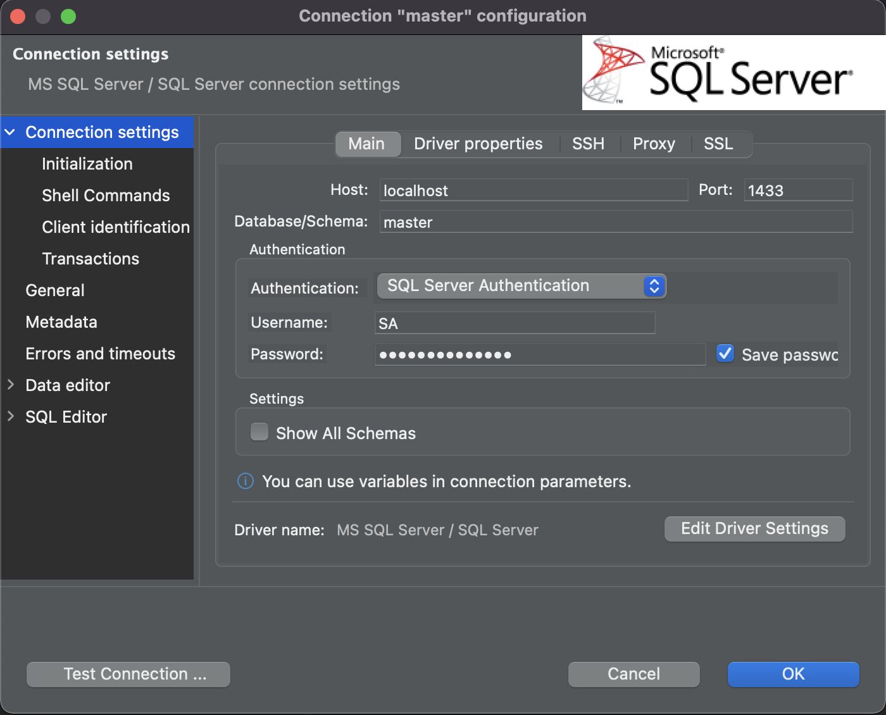

# MICROSOFT SQL SERVER

## Purpose 

This docker-compose file will spin up a Microsoft SQL Server container on your localhost. 

This should be used for local development only. 


---
## Getting Started

1. Set Enviornment Variables 

    | **Environment Variable**      |  **Purpose**                                         |
    | ------------------------------| -----------------------------------------------------|
    |                               |                                                      | 
    | __SA_PASSWORD__               | This is the root password for your database          |
    | __APPLICATION_DB__            | This name of your database                           |
    | __APPLICATION_DB_USER__       | Application user for your database                   |
    | __APPLICATION_DB_PASSWORD__   | Password for your database application user          |


2. Update the setup.sql script

    Under the folder *scripts/setup.sql*, you should update the create schemas, create tables and insert data commands in this script to match the tables you need for your application 

3. Build the Docker Image 
    ```
    make build 
    ```
    OR
    ```
    docker-compose build --no-cache
    ```
    > Note: This is a one of exercise (unless you delete this image)

4. Start the Docker Container 
    ```
    make start
    ```
    OR
    ```
    docker-compose up -d
    ```

5. Create your database 
    ```
    make database
    ```
    OR 
    ```
    docker exec -it sql-server-db /opt/mssql-tools/bin/sqlcmd -S localhost -U SA -P '$(SA_PASSWORD)' -i /usr/config/scripts/setup.sql
    ```

---

## Test Connection

### Test Inside the Docker Container
```
docker exec -it sql-server-db /opt/mssql-tools/bin/sqlcmd -S localhost -U SA -P '$(SA_PASSWORD)'
```

### Test Outside the Docker Container

Using DBeaver 




---
## Using this in a Project

### .NET6

- An example of how to use this in a .NET 6 project can be found 


### Python

- An example of how to use this in a Python project can be found 

---
## Troubleshooting 

### Running on MAC OS 
ERROR: *Invalid mapping of address 0x40094e5000 in reserved address space below 0x400000000000.* 

SOLUTION: *https://github.com/microsoft/mssql-docker/issues/668*

