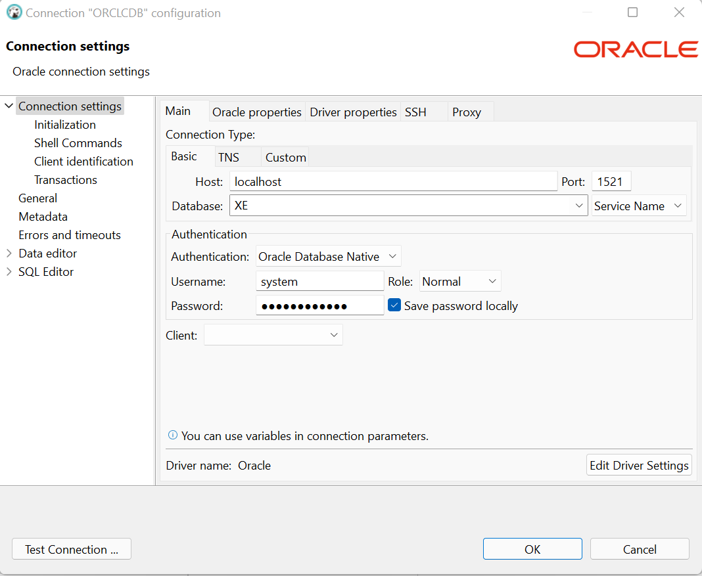

# ORACLE

## Purpose 

This docker-compose file will spin up a Oracle container on your localhost. 

This container should be used to support local development only.

⚠️ This image is very large - approximately 14.6GB. 


Examples:
- https://github.com/oracle/docker-images/tree/main/OracleDatabase/SingleInstance
- https://blogs.oracle.com/connect/post/deliver-oracle-database-18c-express-edition-in-containers


---
## Getting Started


1. Set Enviornment Variables 

    | **Environment Variable**   |  **Purpose**                                         |
    | ---------------------------| -----------------------------------------------------|
    |                            |                                                      | 
    | __ORACLE_PWD__             | This is the password for you __Oracle__ database     |
    |                            |                                                      |

 

2. Build the Docker Image 
    ```
    make build 
    ```
    OR
    ```
    sh ./buildDockerImage.sh -v 18.4.0 -x
    ```
    
    > Note: This image is large so can take some time to download (~30-45 mins)

    > Note: This is a one of exercise (unless you delete this image)


3. Start the Docker Container 
    ```
    make start
    ```
    OR
    ```
    docker-compose up -d
    ```

---

## Test Connection

When initially trying to connect to the Oracle database you may get the following: 
```
ERROR:
ORA-12514: TNS:listener does not currently know of service requested in connect
descriptor
```

### Test Inside the Docker Container
```
docker exec -it oracle-db bash 
```

connect as sysdba
```
sqlplus sys/$ORACLE_PWD@//localhost:1521/XE as sysdba
```

connect as the system user 
```
sqlplus system/$ORACLE_PWD@//localhost:1521/XE
```

connect to the pluggable database 
```
sqlplus pdbadmin/$ORACLE_PWD@//localhost:1521/XEPDB1
```


### Test Outside the Docker Container

Using DBeaver




- DATABASE = localhost 
- PORT = 1521 
- USER = system
- SID = XE


---
## Using this in a Project

### .NET6

- An example of how to use this in a .NET 6 project can be found 


### Python

- An example of how to use this in a Python project can be found 
---
## Troubleshooting 

### Running on MAC M1 

Issue:

- https://github.com/oracle/docker-images/issues/1679
- https://stackoverflow.com/questions/71941876/i-make-a-docker-image-using-linux-and-installed-an-oracle-db-19c-using-the-offic

Solution: 

(a) Start colima
```
colima start --arch amd

colima status
# must show x86_64, otherwise 
colima delete
colima start --arch amd
```

(b) Start the container
```
make start
```


### Connecting to the Oracle Database - ORA-12514

Issue:
```
ERROR:
ORA-12514: TNS:listener does not currently know of service requested in connect
descriptor
```

Solution:

This error may occur immediately after start up. 
You should wait for 5-10 minutes before trying to connect again. 


### Connecting to the Oracle Database - ORA-12526

Issue: 
```
ERROR:
ORA-12526: TNS:listener: all appropriate instances are in restricted mode
```

Solution:

(a) Start a session inside the container
``` 
$ docker exec -it oracle-db bash 
```

(b) Login to the database 
```
sqlplus / as sysdba
```

(c) Remove the restricted mode 
```
alter system disable restricted session;
```

(d) Disconnect from the database and docker container 

(e) Try to reconnect to the database 


